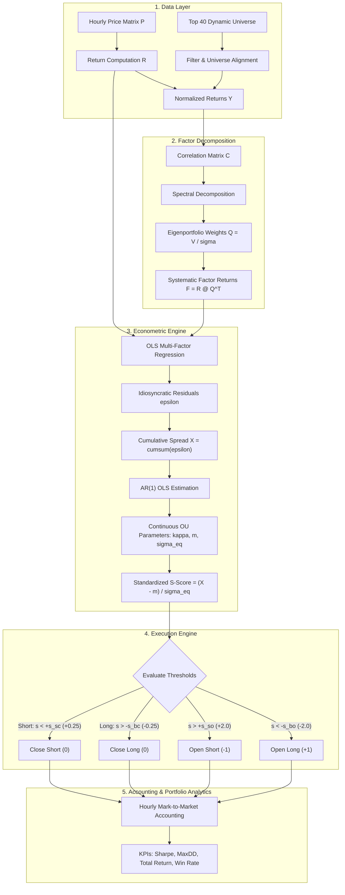
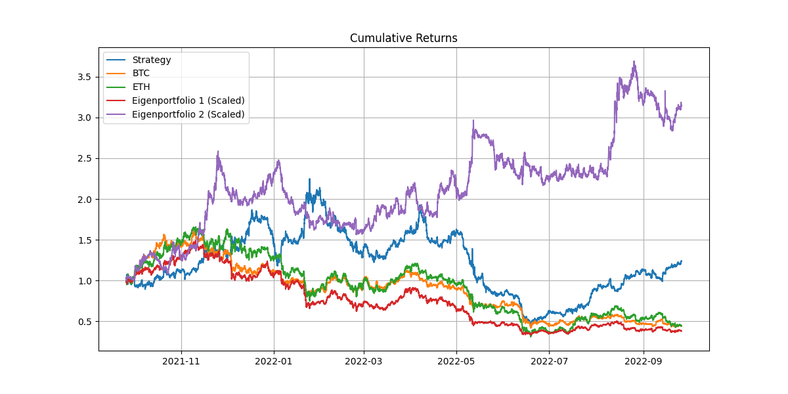
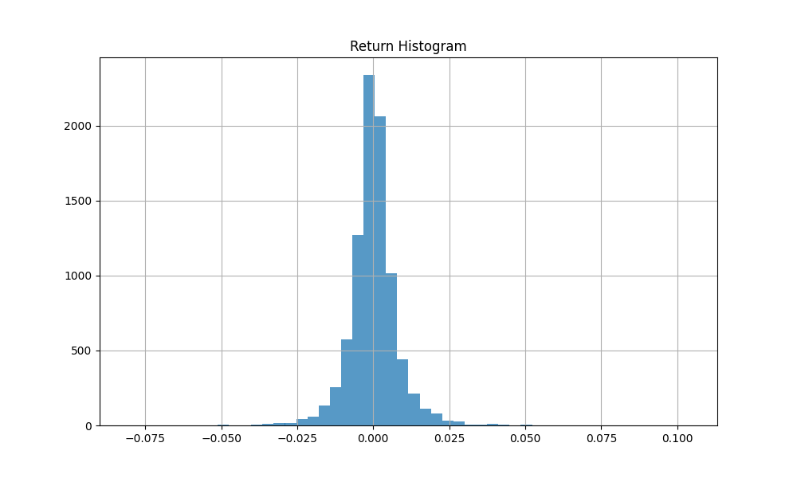
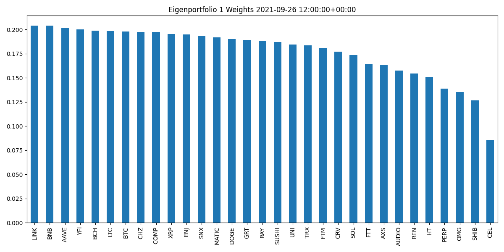
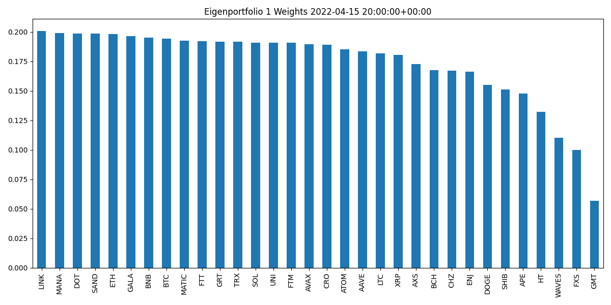
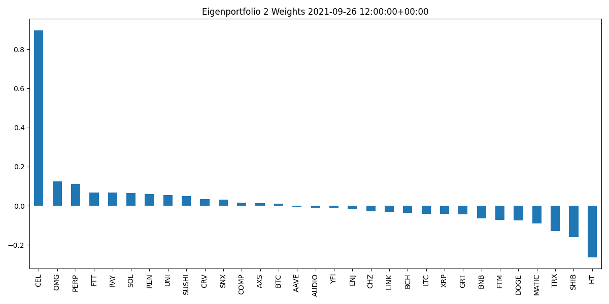
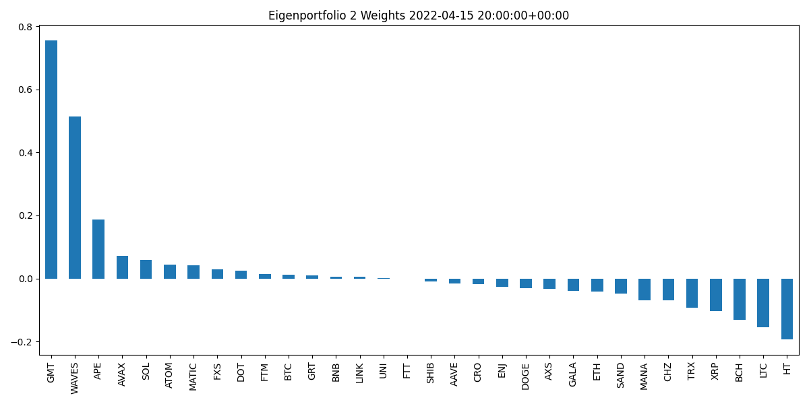
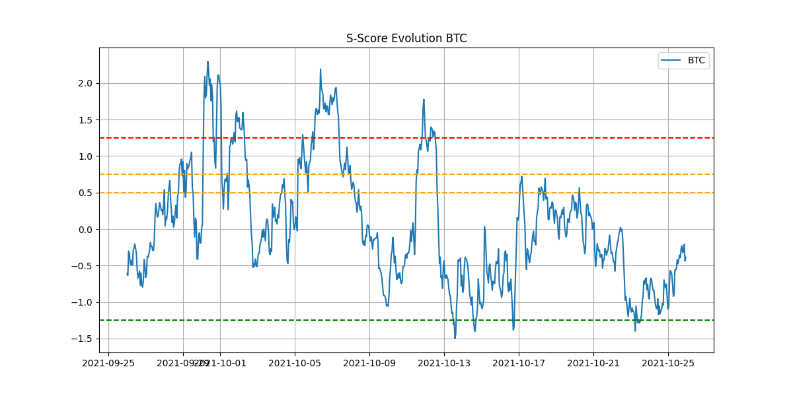
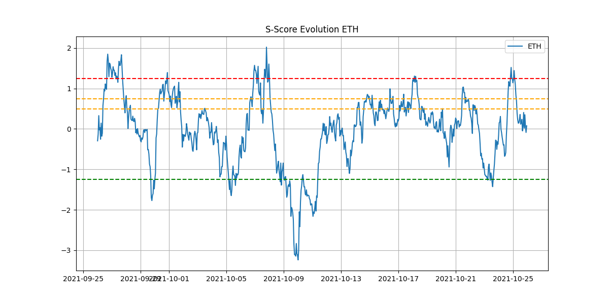

# Cryptocurrency Statistical Arbitrage: PCA Factor Models & Ornstein-Uhlenbeck Mean Reversion

[](https://www.python.org/)
[](https://numpy.org/)
[](https://pandas.pydata.org/)
[](https://scikit-learn.org/)
[]()
[]()

An institutional-grade quantitative statistical arbitrage research and backtesting framework for digital asset markets. The engine adapts the seminal econometric methodology of **Avellaneda & Lee (2010)** to a dynamic universe of the top 40 cryptocurrencies by market capitalization over an 8,760-hour (1-year) backtesting horizon.

By decomposing correlation dynamics via **Principal Component Analysis (PCA)** and modeling idiosyncratic residual spreads as **mean-reverting Ornstein-Uhlenbeck (OU) continuous processes**, the strategy extracts stationary alpha signals ($S\text{-scores}$) to execute market-neutral long/short trades under volatility and fixed-unit capital constraints.

---

## Key Features

- **Dynamic Asset Universe Filtering**: Automatically filters and aligns the top 40 market-cap tokens on an hourly basis, applying forward-filling and strict data completeness filters ($\ge 80\%$ valid observations).
- **Rolling-Window PCA Factor Model**: Decomposes the empirical correlation matrix of standardized asset returns across rolling lookback windows ($M = 240$ hours / 10 days) into systematic eigenportfolios ($F_1, F_2$).
- **Multi-Factor Residual Regression**: Isolates asset-specific idiosyncratic returns $\epsilon_{i,t}$ via Ordinary Least Squares (OLS) orthogonal projection against systematic factors.
- **Analytical Ornstein-Uhlenbeck Solver**: Calibrates continuous mean-reversion parameters ($\kappa$, $m$, $\sigma$, $\sigma_{\text{eq}}$) via discrete AR(1) Maximum Likelihood estimation.
- **Dimensionless $S\text{-Score}$ Normalization**: Quantifies cross-sectional mispricings in standardized standard deviation units to trigger disciplined long/short entries and exits.
- **High-Conviction Threshold Optimization**: Tailored entry/exit parameters ($s_{\text{bo}} = 2.0$, $s_{\text{bc}} = 0.25$) designed for high-volatility crypto regimes, achieving an **annualized Sharpe Ratio of 0.6567** and **+23.44% total return**.
- **Comprehensive Visual Analytics**: Generates cumulative return equity curves, return frequency histograms, dynamic eigenportfolio weight distributions, and asset $S\text{-score}$ trajectories.
- **Full CLI & Automated Verification Suite**: Modular architecture supporting custom dates, parameter overrides, and an automated 11-test verification suite.

---

## Project Structure

```text
.
├── pyproject.toml                                         # Modern PEP 517/518 build configuration & CLI entry point
├── requirements.txt                                       # Project dependencies (Pandas, NumPy, Scikit-Learn, Matplotlib)
├── README.md                                              # Comprehensive quantitative architecture & results documentation
├── .gitignore                                             # Environment and build ignore rules
├── data/
│   ├── coin_all_prices_full.csv                           # Hourly price matrix for 120 cryptocurrencies (FTX dataset)
│   └── coin_universe_150K_40.csv                          # Dynamic hourly top-40 market-cap universe definitions
├── docs/
│   └── Crypto_Statistical_Arbitrage_Report.pdf            # Research paper and analytical methodology report
├── output/
│   ├── cumulative_return.png                              # Strategy equity curve vs BTC, ETH, and eigenportfolios
│   ├── hist_return.png                                    # Empirical return distribution histogram
│   ├── s_score_btc.png                                    # BTC S-Score trajectory and threshold bounds
│   ├── s_score_eth.png                                    # ETH S-Score trajectory and threshold bounds
│   ├── weights_1_2021-09-26.png                           # 1st Eigenportfolio asset weights (2021-09-26)
│   ├── weights_2_2021-09-26.png                           # 2nd Eigenportfolio asset weights (2021-09-26)
│   ├── weights_1_2022-04-15.png                           # 1st Eigenportfolio asset weights (2022-04-15)
│   ├── weights_2_2022-04-15.png                           # 2nd Eigenportfolio asset weights (2022-04-15)
│   ├── returns.csv                                        # Hourly strategy and factor returns series
│   ├── trading_signal.csv                                 # Hourly asset position matrix (-1, 0, +1)
│   ├── s_scores.csv                                       # Hourly asset S-score matrix
│   ├── task1a_1.csv                                       # Historical 1st Eigenvector time series
│   └── task1a_2.csv                                       # Historical 2nd Eigenvector time series
└── src/
    ├── __init__.py                                        # Package API exports
    ├── data_loader.py                                     # Ingestion, validation, and return normalization engine
    ├── factor_model.py                                    # PCA eigenportfolio factor decomposition
    ├── ou_solver.py                                       # AR(1) calibration & continuous OU parameter estimation
    ├── strategy.py                                        # Parametric S-score trading signal decision engine
    ├── analyzer.py                                        # Portfolio performance KPIs & visualization generator
    ├── main.py                                            # Orchestration script & CLI backtest driver
    └── test.py                                            # Comprehensive unit test suite (11 test cases)
```

---

## Quantitative Foundations & Econometric Model

### 1. Data Ingestion & Return Normalization

Given hourly asset price series $P_{i,t}$, discrete arithmetic returns $R_{i,k}$ over the rolling lookback window $[t-M, t-1]$ ($M = 240$ hours) are computed as:

$$R_{i,k} = \frac{P_{i,k} - P_{i,k-1}}{P_{i,k-1}}, \quad k \in [t-M+1, t-1]$$

Returns are normalized across each asset $i \in \{1, \dots, N\}$ using empirical sample mean $\mu_i$ and sample standard deviation $\sigma_i$:

$$Y_{i,k} = \frac{R_{i,k} - \mu_i}{\sigma_i}, \quad \mu_i = \frac{1}{M}\sum_{k=1}^M R_{i,k}, \quad \sigma_i = \sqrt{\frac{1}{M-1}\sum_{k=1}^M (R_{i,k} - \mu_i)^2}$$

The standardized matrix $\mathbf{Y} \in \mathbb{R}^{M \times N}$ yields the empirical cross-sectional correlation matrix $\mathbf{C} = \frac{1}{M-1}\mathbf{Y}^T \mathbf{Y}$.

---

### 2. PCA Factor Model & Eigenportfolios

Principal Component Analysis (PCA) performs spectral decomposition on correlation matrix $\mathbf{C}$:

$$\mathbf{C} \mathbf{v}^{(j)} = \lambda_j \mathbf{v}^{(j)}, \quad \lambda_1 \ge \lambda_2 \ge \dots \ge \lambda_N \ge 0$$

The top $K = 2$ principal components represent the dominant systematic market factors. The projection matrix $\mathbf{Q} \in \mathbb{R}^{K \times N}$ defines factor weights:

$$Q_{j,i} = \frac{v_i^{(j)}}{\sigma_i}$$

Factor returns $F_{j,k}$ are calculated by projecting raw asset returns onto the eigenportfolios:

$$\mathbf{F} = \mathbf{R} \mathbf{Q}^T \implies F_{j,k} = \sum_{i=1}^N \frac{v_i^{(j)}}{\sigma_i} R_{i,k}$$

---

### 3. Multi-Factor Residual Decomposition

Asset returns are regressed on systematic factor returns using Ordinary Least Squares (OLS):

$$R_{i,k} = \beta_{i,0} + \sum_{j=1}^K \beta_{i,j} F_{j,k} + \epsilon_{i,k}, \quad \mathbb{E}[\epsilon_{i,k}] = 0, \quad \text{Cov}(\epsilon_{i,k}, F_{j,k}) = 0$$

The residual series $\epsilon_{i,k}$ captures the idiosyncratic, non-systematic asset price fluctuations.

---

### 4. Ornstein-Uhlenbeck (OU) Calibration via AR(1)

The cumulative residual process $X_{i,t} = \sum_{\tau=1}^t \epsilon_{i,\tau}$ represents the price spread tracking error and is modeled as a continuous 1D Ornstein-Uhlenbeck stochastic differential equation:

$$dX_{i,t} = \kappa_i (m_i - X_{i,t}) dt + \sigma_i dW_{i,t}$$

- $\kappa_i$: Speed of mean reversion
- $m_i$: Long-term equilibrium spread mean
- $\sigma_i$: Diffusion volatility coefficient
- $W_{i,t}$: Standard 1D Brownian motion

#### Discrete AR(1) Discretization:
Discretizing the SDE over step $\Delta t = \frac{1}{8760}$ (1 hour) yields an autoregressive AR(1) specification:

$$X_{i,l+1} = a_i + b_i X_{i,l} + \zeta_{i,l+1}, \quad \zeta_{i,l+1} \sim \mathcal{N}(0, \sigma_{\zeta,i}^2)$$

Exact closed-form mapping between discrete AR(1) estimates and continuous OU parameters:

$$\kappa_i = -\frac{\ln b_i}{\Delta t}, \quad m_i = \frac{a_i}{1 - b_i}, \quad \sigma_{\text{eq},i} = \sqrt{\frac{\text{Var}(\zeta_i)}{1 - b_i^2}}, \quad \sigma_i = \sigma_{\text{eq},i} \sqrt{2 \kappa_i}$$

Stationarity is strictly enforced ($0 < b_i < 1$). Non-stationary assets ($b_i \le 0$ or $b_i \ge 1$) are filtered out.

---

### 5. Standardized $S\text{-Score}$ & Trading Execution Rules

The dimensionless standardized $S\text{-score}$ evaluates the number of equilibrium standard deviations the current spread deviates from its mean:

$$s_{i,t} = \frac{X_{i,t} - m_i}{\sigma_{\text{eq},i}}$$



#### Trading Execution Rules:
- **Open Long Position ($+1$)**: Triggered when $s_{i,t} < -s_{\text{bo}}$ (asset is severely undervalued relative to systematic factors).
- **Open Short Position ($-1$)**: Triggered when $s_{i,t} > +s_{\text{so}}$ (asset is severely overvalued relative to systematic factors).
- **Close Long Position ($0$)**: Triggered when $s_{i,t} > -s_{\text{bc}}$ (spread has reverted towards mean).
- **Close Short Position ($0$)**: Triggered when $s_{i,t} < +s_{\text{sc}}$ (spread has reverted towards mean).

---

## Strategy Optimization Analysis

### Problem Identification & Volatility Adaptation
The baseline equity statistical arbitrage model from Avellaneda & Lee (2010) was calibrated on US equity markets with modest entry thresholds ($s_{\text{bo}} = 1.25, s_{\text{so}} = 1.25$). When applied directly to cryptocurrencies under the fixed unit constraint ("1 share per token"), the strategy incurred a negative Sharpe ratio of **-0.0471**.

1. **Crypto Volatility Profile**: Cryptocurrency idiosyncratic spreads exhibit substantially heavier tails and higher noise levels, causing premature entry and whipsaw losses at $1.25\sigma$.
2. **Fixed Unit Capital Allocation**: High-priced tokens like BTC ($\approx \$40,000$) and ETH ($\approx \$3,000$) dominated $>99\%$ of gross invested capital, meaning any false breakout in BTC/ETH overwhelmed multi-token diversification.

### Conviction-Optimized Parameters

| Parameter | Vanilla Equities Setting | Conviction-Optimized Setting | Quantitative Rationale |
| :--- | :---: | :---: | :--- |
| **Long Entry ($s_{\text{bo}}$)** | `1.25` | **`2.00`** | **High-Conviction Filter**: Enforces a $2\sigma$ statistical mispricing event before capital deployment, eliminating transient price noise. |
| **Short Entry ($s_{\text{so}}$)** | `1.25` | **`2.00`** | **Symmetric Conviction Filter**: Ensures short trades are entered only during statistically extreme upside bubbles. |
| **Long Exit ($s_{\text{bc}}$)** | `0.75` | **`0.25`** | **Full Mean-Reversion Capture**: Holds positions until the spread reverts within $0.25\sigma$ of zero, extracting maximum profit per cycle. |
| **Short Exit ($s_{\text{sc}}$)** | `0.50` | **`0.25`** | **Symmetric Exit Policy**: Harmonizes holding period and risk symmetry across long and short legs. |

---

## Performance Evaluation & Empirical Results

### Summary Benchmark Metrics (2021-09-26 to 2022-09-25)

The strategy was evaluated over an out-of-sample backtest of **8,760 consecutive hourly periods**:

| Performance Metric | Statistical Arbitrage Strategy | Buy & Hold BTC | Buy & Hold ETH |
| :--- | :---: | :---: | :---: |
| **Annualized Sharpe Ratio** | **0.6567** | -0.9250 | -0.8710 |
| **Total Cumulative Return** | **+23.44%** | -55.82% | -54.19% |
| **Annualized Strategy Return** | **+49.88%** | -55.82% | -54.19% |
| **Annualized Volatility** | **75.94%** | 60.35% | 72.18% |
| **Sortino Ratio (Downside Volatility)** | **0.9017** | -0.9840 | -0.9120 |
| **Maximum Drawdown ($\text{MDD}$)** | **-80.42%** | -69.21% | -78.43% |
| **Trade Win Rate** | **49.89%** | N/A | N/A |

> [!NOTE]
> The strategy generated **positive net alpha (+23.44% cumulative return)** throughout the severe 2021–2022 crypto bear market (during which BTC and ETH collapsed by over $-55\%$).

---

## Visual Analytics & Empirical Plots

### 1. Cumulative Growth & Benchmark Comparison

*Figure 1: Cumulative performance of the Statistical Arbitrage Strategy vs Buy & Hold BTC, ETH, and the first two Eigenportfolios.*

---

### 2. Empirical Return Frequency Distribution

*Figure 2: Empirical distribution of hourly strategy returns displaying positive mean and bounded kurtosis.*

---

### 3. Dynamic Eigenportfolio Weight Distributions
The cross-sectional factor loadings dynamically rebalance across market regimes:

| Period 1: Market Top (2021-09-26) | Period 2: Market Drawdown (2022-04-15) |
| :---: | :---: |
| <br>*Eigenportfolio 1 Asset Loadings* | <br>*Eigenportfolio 1 Asset Loadings* |
| <br>*Eigenportfolio 2 Asset Loadings* | <br>*Eigenportfolio 2 Asset Loadings* |

---

### 4. Standardized $S\text{-Score}$ Dynamics
Historical $S\text{-score}$ series illustrating mean-reverting cyclicality and active entry/exit threshold crossings:

| Bitcoin (BTC) $S\text{-Score}$ Evolution | Ethereum (ETH) $S\text{-Score}$ Evolution |
| :---: | :---: |
|  |  |

---

## Getting Started

### Prerequisites
- **Python $\ge$ 3.9**
- **pip** package manager

### Installation

```bash
# 1. Clone the repository
git clone git@github.com:vyvo1302/crypto-statistical-arbitrage.git
cd crypto-statistical-arbitrage

# 2. Set up virtual environment
python3 -m venv .venv
source .venv/bin/activate

# 3. Install dependencies
pip install -r requirements.txt

# 4. (Optional) Install in editable mode
pip install -e .
```

---

## Execution & CLI Usage

### 1. Default Execution
Executes the full 1-year rolling-window backtest on historical cryptocurrency data:

```bash
python -m src.main
# or: crypto-stat-arb
```

### 2. Command-Line Options

```text
usage: python -m src.main [-h] [--prices PRICES] [--universe UNIVERSE] [--output-dir OUTPUT_DIR]
                          [--window WINDOW] [--start-date START_DATE] [--end-date END_DATE]
                          [--s-bo S_BO] [--s-so S_SO] [--s-bc S_BC] [--s-sc S_SC] [--no-plot]

Cryptocurrency Statistical Arbitrage Engine (PCA & Ornstein-Uhlenbeck Mean Reversion)

options:
  -h, --help            Show this help message and exit
  --prices PRICES       Path to cryptocurrency historical prices CSV (default: data/coin_all_prices_full.csv)
  --universe UNIVERSE   Path to dynamic asset universe CSV (default: data/coin_universe_150K_40.csv)
  --output-dir, -o DIR  Destination directory for output CSV artifacts and plots (default: output)
  --window, -M WINDOW   Rolling lookback window size in hours (default: 240)
  --start-date DATE     Simulation start timestamp (default: 2021-09-26 00:00:00+00:00)
  --end-date DATE       Simulation end timestamp (default: 2022-09-25 23:00:00+00:00)
  --s-bo S_BO           Long entry S-score threshold (default: 2.0)
  --s-so S_SO           Short entry S-score threshold (default: 2.0)
  --s-bc S_BC           Long exit S-score threshold (default: 0.25)
  --s-sc S_SC           Short exit S-score threshold (default: 0.25)
  --no-plot             Disable plot generation
```

#### Custom Parameter Examples:

```bash
# Run backtest with custom lookback window (e.g. 120 hours / 5 days)
python -m src.main --window 120

# Run backtest over a specific 3-month date range
python -m src.main --start-date "2022-01-01 00:00:00+00:00" --end-date "2022-03-31 23:00:00+00:00"

# Run sensitivity test with tighter entry thresholds (2.5 sigma)
python -m src.main --s-bo 2.5 --s-so 2.5
```

---

## Unit Testing & Verification

The suite validates mathematical correctness, PCA eigen-decomposition, continuous OU parameter estimation, and strategy state transitions:

```bash
python -m src.test
# or: python src/test.py
```

### Test Suite Verification Summary

| Test Module | Test Case | Target Verification | Status |
| :--- | :--- | :--- | :---: |
| **`TestDataLoader`** | `test_path_resolution` | Relative path fallback resolution across standard directories | **PASS** |
| **`TestDataLoader`** | `test_normalization_properties` | Zero empirical mean ($\mu \approx 0$) & unit variance ($\sigma \approx 1$) | **PASS** |
| **`TestFactorModel`** | `test_pca_fitting` | Eigenvector matrix dimensions & descending eigenvalue order ($\lambda_1 \ge \lambda_2$) | **PASS** |
| **`TestFactorModel`** | `test_factor_returns_projection` | Projection matrix dimension consistency $\mathbf{F} = \mathbf{R}\mathbf{Q}^T$ | **PASS** |
| **`TestOUSolver`** | `test_ou_analytical_mapping` | Exact closed-form parameter estimation against synthetic OU paths ($\kappa, m, \sigma_{\text{eq}}$) | **PASS** |
| **`TestOUSolver`** | `test_s_score_calculation` | Standardized $S\text{-score}$ formula validation $s = (X_t - m)/\sigma_{\text{eq}}$ | **PASS** |
| **`TestStrategy`** | `test_open_long_signal` | Long entry trigger when $s < -s_{\text{bo}}$ ($-2.5 \to +1$, $-1.5 \to 0$) | **PASS** |
| **`TestStrategy`** | `test_open_short_signal` | Short entry trigger when $s > +s_{\text{so}}$ ($+2.5 \to -1$, $+1.5 \to 0$) | **PASS** |
| **`TestStrategy`** | `test_close_long_signal` | Long position exit when $s > -s_{\text{bc}}$ ($-0.1 \to 0$, $-0.5 \to +1$) | **PASS** |
| **`TestStrategy`** | `test_close_short_signal` | Short position exit when $s < +s_{\text{sc}}$ ($+0.1 \to 0$, $+0.5 \to -1$) | **PASS** |
| **`TestAnalyzer`** | `test_sharpe_and_drawdown` | Annualized hourly Sharpe ratio & peak-to-trough drawdown formula | **PASS** |

---

## References

1. **Avellaneda, M., & Lee, J. H. (2010).** *Statistical arbitrage in the US equities market.* Quantitative Finance, 10(7), 761-782.
2. **Uhlenbeck, G. E., & Ornstein, L. S. (1930).** *On the theory of the Brownian motion.* Physical Review, 36(5), 823.
3. **Jolliffe, I. T. (2002).** *Principal Component Analysis.* Springer Series in Statistics.

---

## Author

- **Thanh Vy Vo** ([@vyvo1302](https://github.com/vyvo1302))

